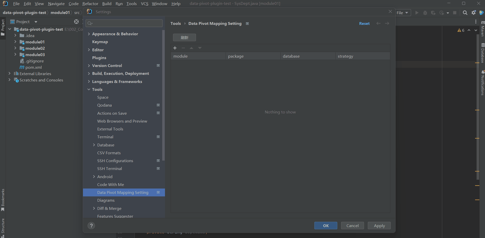
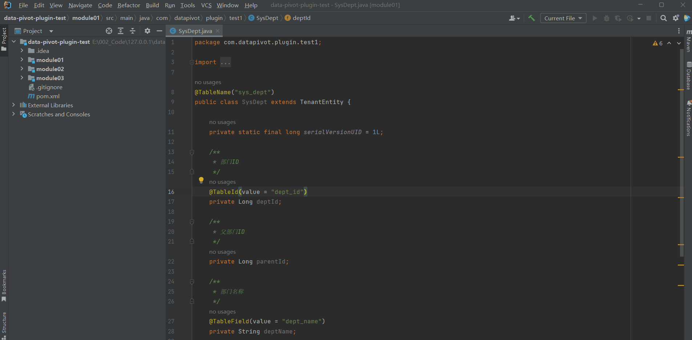
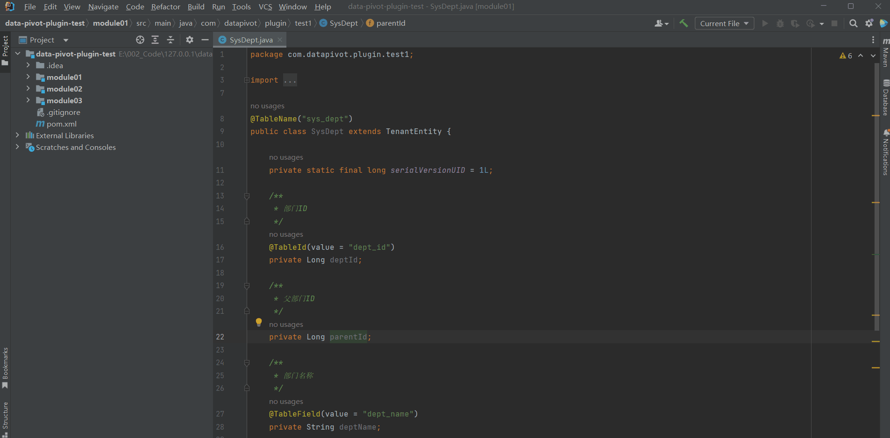
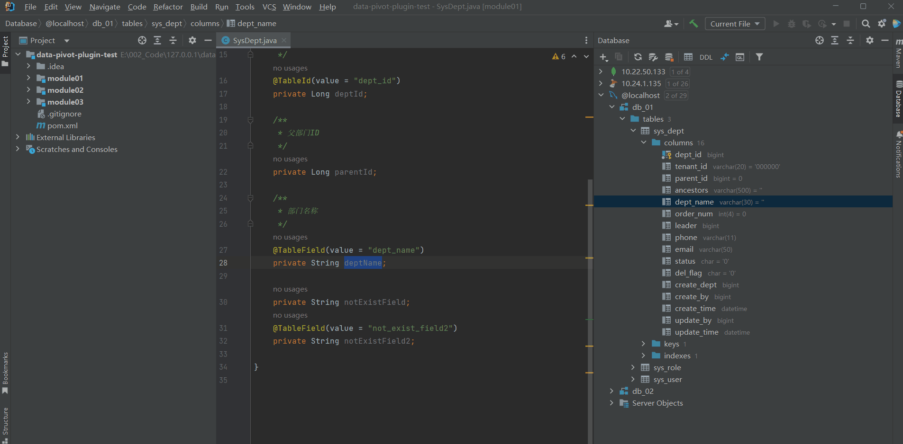
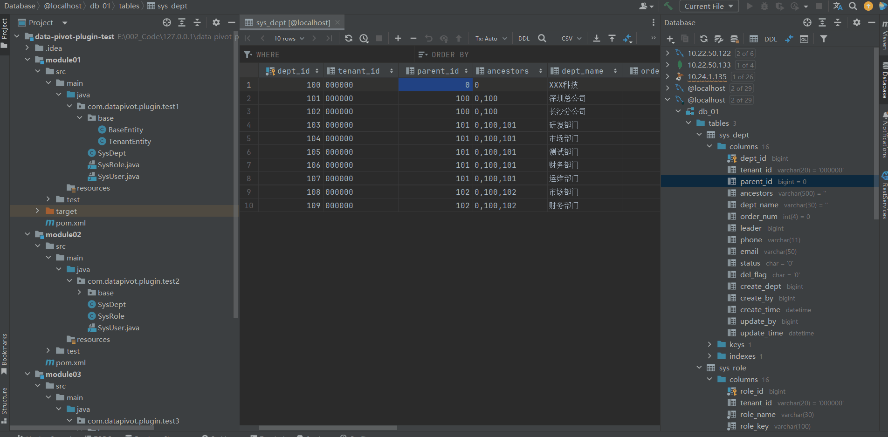

```banner
________      _____________________           __________._______   _______________________
\______ \    /  _  \__    ___/  _  \          \______   \   \   \ /   /\_____  \__    ___/
 |    |  \  /  /_\  \|    | /  /_\  \   ______ |     ___/   |\   Y   /  /   |   \|    |   
 |    `   \/    |    \    |/    |    \ /_____/ |    |   |   | \     /  /    |    \    |   
/_______  /\____|__  /____|\____|__  /         |____|   |___|  \___/   \_______  /____|   
        \/         \/              \/                                          \/         
```
# data-pivot-plugin

[](https://plugins.jetbrains.com/plugin/com.github.wl2027.datapivotplugin)
[](https://plugins.jetbrains.com/plugin/com.github.wl2027.datapivotplugin)


## Introduction
<!-- Plugin description -->
### English:
data-pivot is a plugin developed based on the IntelliJ IDEA IU platform, specifically designed for complex database scenarios encountered in project development.

Facing challenges such as a large number of database tables, numerous columns, or special naming conventions, data-pivot provides developers with convenient field data report analysis capabilities as well as intelligent ORM and ROM navigation jumps between class fields and database columns.

Using the data-pivot plugin, you can easily achieve the following operations:
- Analyze field data in real-time, including data values and their proportion, providing you with detailed report information.
- Quickly and conveniently navigate between code and database columns, greatly improving work efficiency.

Currently, the plugin fully supports the MySQL database and provides multiple mapping strategies, including mybatis-plug annotations, jpa annotations, and camel case underscore naming conventions.

In the future, we will continue to expand the plugin's capabilities to support custom SQL queries and custom strategy mappings, while also adapting to more databases such as MongoDB, SQL Server, PostgreSQL, and more.
### 中文:

data-pivot是一款基于IntelliJ IDEA IU平台开发的插件，为项目开发中遇到的复杂数据库场景设计。

面对大量数据库表、众多字段或特殊命名规则等挑战，data-pivot为开发者提供了便捷的字段数据报表分析功能，以及智能的类字段与数据库字段之间的ORM和ROM导航跳转。

使用data-pivot插件，您可以轻松实现以下操作：
- 实时分析字段数据情况，包括数据值及其数量占比等，为您提供详尽的报表信息。
- 快速便捷地在代码与数据库字段之间进行导航跳转，极大提高工作效率。

目前，该插件已全面支持MySQL数据库，并提供了多种映射策略， 包括mybatis-plug注解、jpa注解以及驼峰下划线命名规则等。

未来将继续扩展插件功能，支持自定义SQL查询和自定义策略映射， 同时适配MongoDB、SQL Server、PostgreSQL等更多数据库。
<!-- Plugin description end -->

## Features

- **Ease of Operation**: With just a simple mapping configuration, you can effortlessly utilize the three core functionalities of field data analysis, ORM navigation, and ROM navigation.
- **Data Analysis**: Perform real-time data analysis on code fields, eliminating the need to frequently switch between IDEs for brief SQL queries. This allows you to focus more on writing high-quality code.
- **Intelligent Navigation**: Efficiently jump between fields in your code, assisting developers in quickly finding and navigating to the desired fields in complex database scenarios, thus eliminating the tedious process of field searching.- 
- **操作简单**: 仅需进行简单的映射配置，即可轻松使用字段数据分析、ORM跳转和ROM跳转三大核心功能.
- **数据分析**: 实时进行代码字段的数据分析,开发过程中无需频繁切换IDE进行简短的SQL查询，从而更加专注于编写高质量的代码。
- **智能导航**: 对代码进行高效的字段跳转,帮助开发者在复杂的数据库场景中高效地查找和跳转到所需字段，省去了繁琐的字段查找过程。

## Installation

- **Using the IDE built-in plugin system:**

  <kbd>Settings/Preferences</kbd> > <kbd>Plugins</kbd> > <kbd>Marketplace</kbd> > <kbd>Search for "data-pivot"</kbd> >
  <kbd>Install</kbd>

- **Manually:**

  Download the [latest release](https://github.com/wl2027/data-pivot-plugin/releases/latest) and install it manually using
  <kbd>Settings/Preferences</kbd> > <kbd>Plugins</kbd> > <kbd>⚙️</kbd> > <kbd>Install plugin from disk...</kbd>

Restart the **IDE** after installation.

## Using The Plugin

1. Set Project Mapping Strategy 设置项目映射策略


2. Perform Data Analysis on Class Fields 类字段进行数据分析
   

3. Navigate and Jump between Class Fields 类字段进行导航跳转
   

4. Navigate and Jump between Database columns 数据库字段进行导航跳转
   

5. Navigation and jumping of fields in the database console 在数据库控制台进行字段进行导航跳转
   

## Compatibility

- [ ] Android Studio
- [ ] AppCode
- [ ] CLion
- [ ] DataGrip
- [ ] GoLand
- [ ] HUAWEI DevEco Studio
- [x] **IntelliJ IDEA Ultimate**
- [ ] IntelliJ IDEA Community
- [ ] IntelliJ IDEA Educational
- [ ] MPS
- [ ] PhpStorm
- [ ] PyCharm Professional
- [ ] PyCharm Community
- [ ] PyCharm Educational
- [ ] Rider
- [ ] RubyMine
- [ ] WebStorm


## Contributing

Welcome to contribute to the project! You can fix bugs by submitting a Pull Request (PR) or discuss new features or changes by creating an [Issue](https://github.com/wl2027/data-pivot-plugin/issues/). Look forward to your valuable contributions!

欢迎参与项目贡献！如您可以通过提交Pull Request（PR）来修复bug，或者新建 [Issue](https://github.com/wl2027/data-pivot-plugin/issues/) 来讨论新特性或变更，期待您的宝贵贡献！

---
Plugin based on the [IntelliJ Platform Plugin Template][template].

[template]: https://github.com/JetBrains/intellij-platform-plugin-template
[docs:plugin-description]: https://plugins.jetbrains.com/docs/intellij/plugin-user-experience.html#plugin-description-and-presentation
