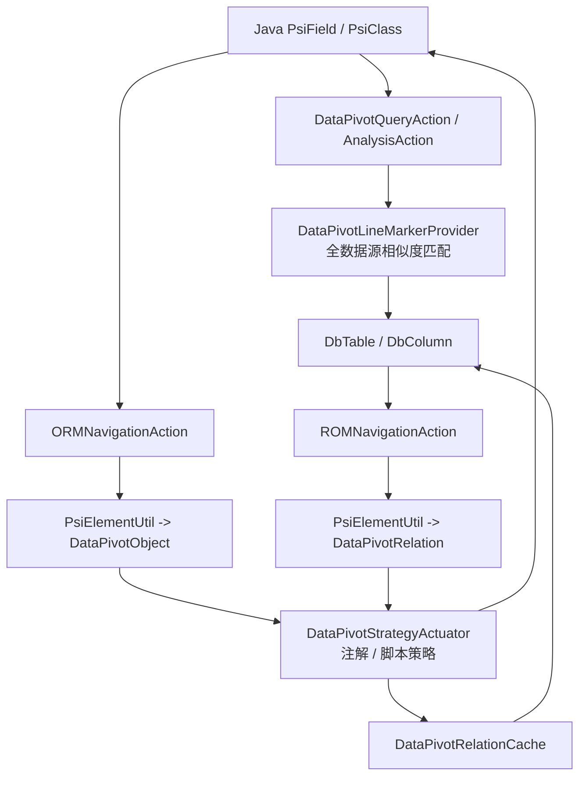
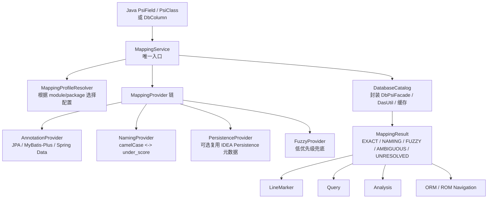
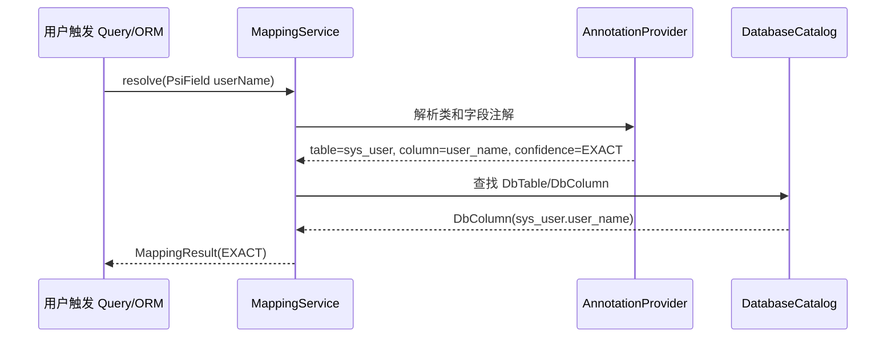
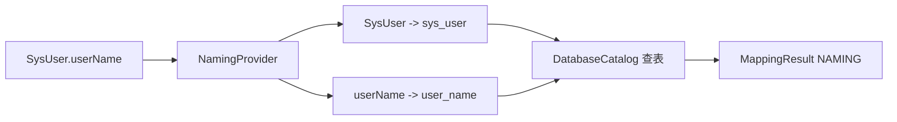

**当前结构**


这里最别扭的是：
[DataPivotQueryAction.java](/Users/weil/Desktop/workspaces/contribute/data-pivot/src/main/java/com/data/pivot/plugin/actions/DataPivotQueryAction.java:59) 查询时直接调用 `DataPivotLineMarkerProvider.getTableInfo()`，而 [ORMNavigationAction.java](/Users/weil/Desktop/workspaces/contribute/data-pivot/src/main/java/com/data/pivot/plugin/actions/ORMNavigationAction.java:28) 跳转时走 `DataPivotApplication.ormMapping()`。也就是说，同一个字段，“查询认为的表”和“跳转认为的表”理论上可能不是同一个。

**主要问题**
1. **映射逻辑分散**
   行标、查询、分析、ORM、ROM 都在各自入口里拼逻辑。应该只有一个 `MappingService`。

2. **相似度匹配权重过高**
   [DataPivotLineMarkerProvider.java](/Users/weil/Desktop/workspaces/contribute/data-pivot/src/main/java/com/data/pivot/plugin/config/DataPivotLineMarkerProvider.java:95) 会扫所有数据源表，再用 Jaro-Winkler 相似度匹配。大库、多 schema、同名前缀表时容易误跳。

3. **策略模型过度抽象但不够清晰**
   [DataPivotStrategyActuator.java](/Users/weil/Desktop/workspaces/contribute/data-pivot/src/main/java/com/data/pivot/plugin/model/DataPivotStrategyActuator.java:83) 里用 `ANNOTATION` / `SCRIPT` 抽象，但现在 script 实际只支持几个固定命名转换。这个抽象看起来灵活，实际增加理解成本。

4. **DTO 承载太多派生信息**
   `DataPivotObject`、`DataPivotRelation` 同时装 PSI、module、package、className、fieldName、reference、setting、strategy，容易出现字段不同步。

**建议结构**


核心变化：**所有功能都问 `MappingService`，不要各自猜。**

**举例**
假设代码：

```java
@TableName("sys_user")
class User {
    @TableField("user_name")
    private String userName;
}
```

数据库：

```sql
sys_user.user_name
```

理想流程应该是：



如果没有注解：

```java
class SysUser {
    private String userName;
}
```

就走命名策略：



如果匹配到多个：

```text
sys_user.user_name
biz_user.user_name
```

不要直接跳。返回：

```text
MappingResult = AMBIGUOUS
candidates = [sys_user.user_name, biz_user.user_name]
```

让用户选择，并把选择固化到 Mapping Profile。

**更舒服的配置模型**
建议把现在的配置改成“映射 Profile”：

```text
Profile: default-user-center
Scope: module=user-service, package=com.foo.user
DataSource: local-mysql
Schema/Database: app
Providers:
  1. MyBatisPlusAnnotation
  2. JpaAnnotation
  3. CamelUnderlineNaming
Fallback:
  fuzzy = off 或 warning-only
```

这样用户理解起来是：
“这个包下面的实体，用哪个数据源、哪个库、哪些映射规则。”

**结论**
当前设计方向是对的：做 Java 字段和数据库字段的双向映射。但实现应该收敛成：

```text
MappingProfile + MappingProvider + DatabaseCatalog + MappingResult
```

然后让 Query、Analysis、LineMarker、ORM、ROM 全部复用同一套结果。这样功能会更稳，配置更简单，后面扩展 MyBatis XML、Spring Data、jOOQ、Kotlin data class 也不会越写越绕。